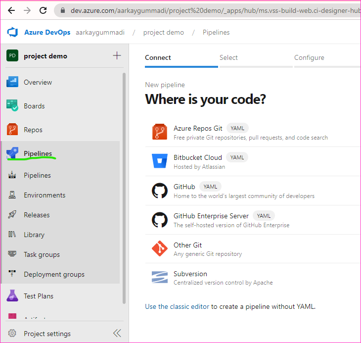
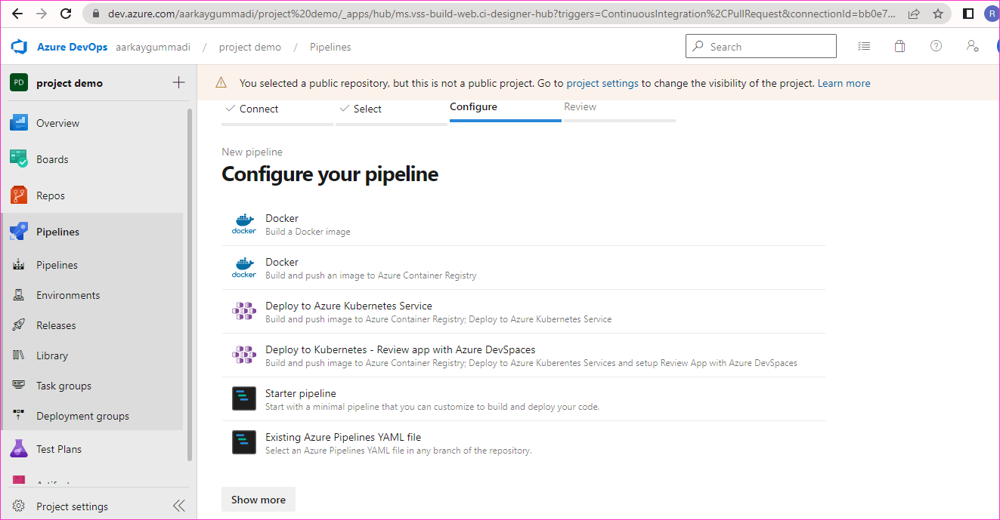
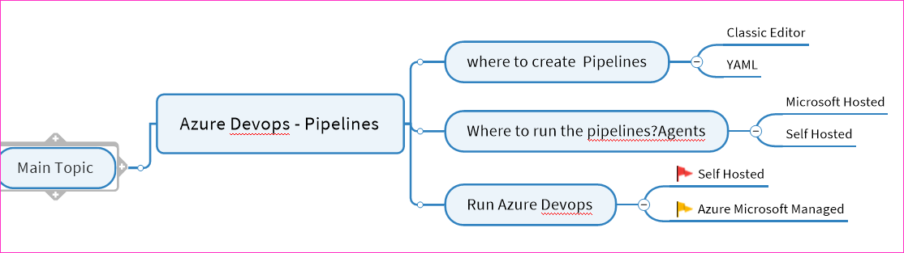
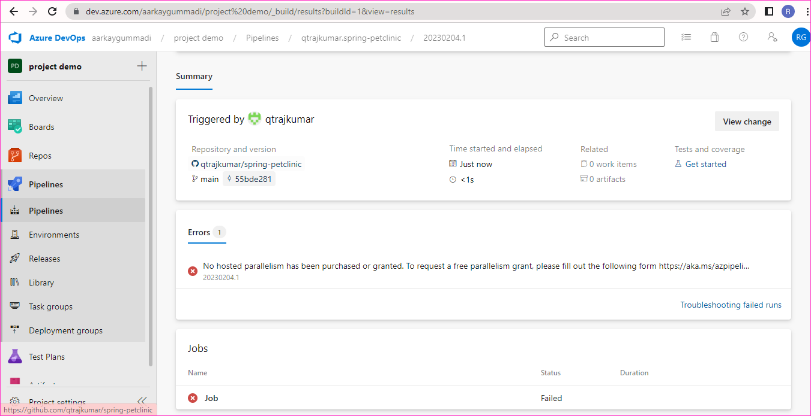

Spring pet Clinic
------------------

To create a EC2 instances and connect to the server


```
sudo apt update
sudo apt install openjdk-17-jdk -y
sudo apt install maven -y
wget https://github.com/spring-projects/spring-petclinic.git
cd spring-petclinic
mvn package
```
```
sudo apt install tree -y
tree
tree target
cd target
java -jar spring-petclinic-3.0.0-SNAPSHOT.jar
```
* Whenver any changes are made to the spring pet clinic code we want to repeat the above steps, if it fails the changes done by developer might be wrong , environmental issues should be handled by us.
* Any failure generally will be notified via emails/some alerting mechanism.
  

Azure Devops - Pipelines
---------------------------

> [Refer Here](https://azure.microsoft.com/en-us/products/devops/server) for the official docs
* Classic Editor
  
  
  

  


  * The error below is about agent not getting allocated.
  

  * Now navigate to project settings and Parallel jobs 
  ![preview]

  * Lets try acheiving the same using YAML
```yaml
pool: 'Azure Pipelines'


triggers:
  - main

steps:
  - tasks: Maven@3
    inputs: 
      mavenPomzgilrz: 'Pom   
  


Azure Devops Explained
-----------------------

* Continuous Integration Workflow


* CI can be failed due to following reasons
    * compilation failed 
    * unit test failed
    * Quality Gate rejected the commit ()
    * Environmental issuies