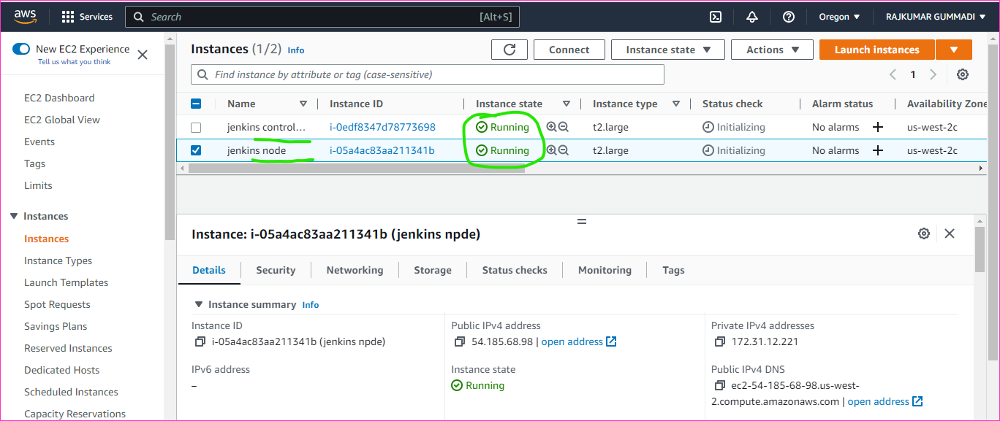
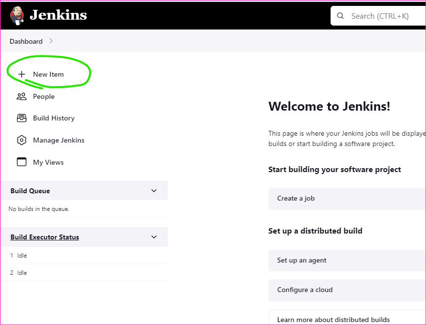
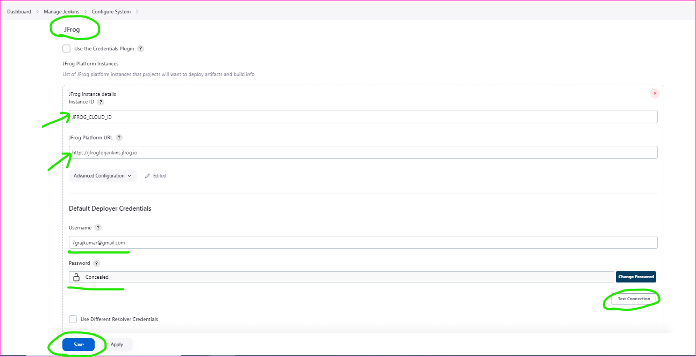

Configuring the sonarcloud and jfrog artifactory for projects
--------------------------------------------------------------

* Firstly take instance type as t2.large and take 2 instances
    * In first instance we have to install the openjdk-17-jdk and maven and jenkins(Long Term Support release)[refer here](https://www.jenkins.io/doc/book/installing/linux/#long-term-support-release) for the LTS release official docs.



* Lets us wait for instance state is running and status checks are 2/2 checks passed
```
sudo apt update
sudo apt install openjdk-17-jdk maven -y
curl -fsSL https://pkg.jenkins.io/debian-stable/jenkins.io.key | sudo tee \
  /usr/share/keyrings/jenkins-keyring.asc > /dev/null
echo deb [signed-by=/usr/share/keyrings/jenkins-keyring.asc] \
  https://pkg.jenkins.io/debian-stable binary/ | sudo tee \
  /etc/apt/sources.list.d/jenkins.list > /dev/null
sudo apt update
sudo apt install jenkins

```


    * next second instance we have to install opnejdk-8-jdk and openjdk-11-jdk and maven

```
sudo apt update
sudo apt install openjdk-8-jdk openjdk-11-jdk maven -y
```


* And then will run commad `cat /etc/passwd` it will show the list of all user and in that users we have a jenkins user created


* Add jenkins user to sudoers the command is `sudo visudo`

* Take the controller public ip address and open browser and add new tab and run the command `http://35.90.104.120:8080`


* Its getting started to install required plugins
* Fill the above fields and click on save and continue

* Next without doing anything just click on save and finish


* In that Global Tool configuration a little bit scroll down you see the JDK and add java versions and home path of the java 





* And add one more project called FreeStyle

* Go to Manage Jenkins => Manage credentials


* Take the jenkins nodes private key and paste it on 'New credentials => ID'


```
 ls
cp jenkins.pem /tmp/
sudo chown jenkins:jenkins /tmp/jenkins.pem
sudo chmod 400 /tmp/jenkins.pem
ls -al /tmp/ | grep jenkins.pem
sudo -i
ls
ssh -i /tmp/jenkins.pem ubuntu@172.31.12.221
cd ~/.ssh/
ls
```


* Add one more Declaratice project called springpetclinic-Declarative


* It was trying to tell that jdk version was not present


* Execute in jenkins node 
```
mvn --version
sudo apt install openjdk-17-jdk -y
export PATH="/usr/lib/jvm/java-17-openjdk-amd64/bin:$PATH"
mvn --version
```


* Its fail the build because of that the java is not present correctly


* There is a some setting problem to solve it


* This token for Created Jfrog credential



* This token for Created SonarQube credential


* Added the maven path in Global Tool Configuration


[refer here](https://github.com/qtrajkumarmarch23/spring-petclinic/blob/main/Jenkinsfile) for the changes in jenkinsfile to added the sonarqube steps


```Jenkinsfile
pipeline {
    agent { label 'JDK_8' }
    triggers { pollSCM ('* * * * *') }
    parameters {
        choice(name: 'MAVEN_GOAL', choices: ['package', 'install', 'clean'], description: 'MAVEN_GOAL')
    }
    stages {
        stage('vcs') {
            steps {
                git url: 'https://github.com/qtrajkumarmarch23/spring-petclinic.git',
                    branch: 'main'
            }
        }
        stage('package') {
            tools {
                jdk 'JDK_17'
            }
            steps {
                sh "mvn ${params.MAVEN_GOAL}"
            }
        }
        stage('sonar analysis') {
            steps {
                // performing sonarqube analysis with "withSonarQubeENV(<Name of Server configured in Jenkins>)"
                withSonarQubeEnv('SONAR_TOKEN') {
                    sh 'mvn verify org.sonarsource.scanner.maven:sonar-maven-plugin:sonar -Dsonar.projectKey=springpetclinic07_sonar -Dsonar.organization=springpetclinic07'
                }
            }
        }
        stage('post build') {
            steps {
                archiveArtifacts artifacts: '**/target/spring-petclinic-3.0.0-SNAPSHOT.jar',
                                 onlyIfSuccessful: true
                junit testResults: '**/surefire-reports/TEST-*.xml'                 
            }
        }
    }
}
```


* Jenkinsfile for jfrog

```Jenkinsfile
pipeline {
    agent { label 'JDK_8' }
    triggers { pollSCM ('* * * * *') }
    parameters {
        choice(name: 'MAVEN_GOAL', choices: ['package', 'install', 'clean'], description: 'MAVEN_GOAL')
    }
    stages {
        stage('vcs') {
            steps {
                git url: 'https://github.com/qtrajkumarmarch23/spring-petclinic.git',
                    branch: 'main'
            }
        }
        stage('package') {
            tools {
                jdk 'JDK_17'
            }
            steps {
                sh "mvn ${params.MAVEN_GOAL}"
            }
        }
        stage ('Artifactory configuration') {
            steps {
                rtServer (
                    id: "ARTIFACTORY_SERVER",
                    url: 'https://qtkhajamarch23.jfrog.io/artifactory',
                    credentialsId: 'JFROG_CLOUD_ADMIN'
                )

                rtMavenDeployer (
                    id: "MAVEN_DEPLOYER",
                    serverId: "ARTIFACTORY_SERVER",
                    releaseRepo: 'libs-release',
                    snapshotRepo: 'libs-snapshot'
                )

                rtMavenResolver (
                    id: "MAVEN_RESOLVER",
                    serverId: "ARTIFACTORY_SERVER",
                    releaseRepo: 'libs-release',
                    snapshotRepo: 'libs-snapshot'
                )
            }
        }
        stage('package') {
            tools {
                jdk 'JDK_17'
            }
            steps {
                rtMavenRun (
                    tool: 'MAVEN_CLOUD_TOKEN',
                    pom: 'pom.xml',
                    goals: 'clean install',
                    deployerId: "MAVEN_DEPLOYER"
                    
                )
                rtPublishBuildInfo (
                    serverId: "ARTIFACTORY_SERVER"
                )
                //sh "mvn ${params.MAVEN_GOAL}"
            }
        }
        stage('sonar analysis') {
            steps {
                // performing sonarqube analysis with "withSonarQubeENV(<Name of Server configured in Jenkins>)"
                withSonarQubeEnv('SONAR_TOKEN') {
                    sh 'mvn verify org.sonarsource.scanner.maven:sonar-maven-plugin:sonar -Dsonar.projectKey=springpetclinic07_sonar -Dsonar.organization=springpetclinic07'
                }
            }
        }
        stage('post build') {
            steps {
                archiveArtifacts artifacts: '**/target/spring-petclinic-3.0.0-SNAPSHOT.jar',
                                 onlyIfSuccessful: true
                junit testResults: '**/surefire-reports/TEST-*.xml'                 
            }
        }
    }
}
```
* Added the jfrog to the jenkinsfile

* Jfrog => Builds


* This is for Maven project for FreeStyle

* This is for MutliBranch Project fo Declarative with defferent branches

* One thing will fail in the main branch, because of in the Jenkinsfile we didn't change the steps of jfrog and sonarqube, that things are remove the main branch also will be success.


* Some changes in the Jenkinsfile of main branch

* The main branch we have a project will be fail, we have a solution for that.
* It will starts working on the changes in the main branch Jenkinsfile


![preview]
![preview]
![preview]

![preview]
![preview]
![preview]
![preview]
![preview]
![preview]
![preview]
![preview]
![preview]
![preview]


